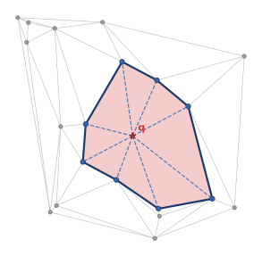
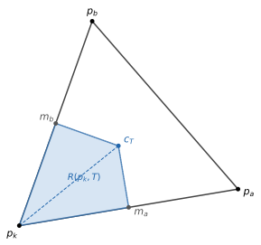
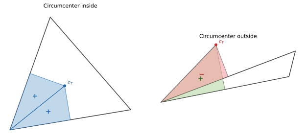

Insertion-free Sibson interpolation
====================================

The problem with insert-remove
------------------------------

The original Sibson interpolation algorithm :footcite:`sibson1981brief`
computes a query point's weight for each natural neighbor by measuring how
much Voronoi volume that neighbor loses when the query is inserted into the
diagram. The standard implementation does this literally: insert the query
into the Delaunay tetrahedralization, read off the volume changes, then
remove it :footcite:`ledoux2005efficient`.

This works, but it mutates the mesh. For parallel evaluation of many query
points, each thread needs its own copy of the entire tetrahedralization,
because two threads cannot insert into the same mesh concurrently. With
16 threads and millions of tetrahedra, that means 16 copies of a large
data structure in memory, plus the cost of copying it.

A read-only alternative
-----------------------

The insertion-free approach computes the same weights without modifying
the mesh. The mesh is read-only throughout, so all threads can share a
single copy. The per-thread state reduces to a small scratch buffer
(a few kilobytes of arrays).

The idea builds on the Bowyer-Watson cavity
:footcite:`bowyer1981computing,watson1981computing`: the set of tetrahedra
whose circumspheres contain the query point. Finding this cavity is a BFS
from the containing simplex and touches only local neighborhood pointers.
No insertion, no deletion.

   **The cavity and its boundary (2D analogue).** Red-shaded triangles form the
   cavity — those whose circumcircles contain the query point *q* (red star).
   Thick dark edges are the cavity boundary. Dashed lines show the virtual
   triangles connecting *q* to boundary vertices. Blue dots are the natural
   neighbors; gray dots are unaffected data points.

The cavity and its boundary contain all the geometric information needed
to compute Sibson weights. We just need to extract the stolen volumes
from circumcenter geometry rather than from actual mesh changes.

The 2D version of this idea is well-documented in CGAL and in the Tinfour
library by G.W. Lucas, where the Voronoi cell overlap reduces to polygon
areas from circumcenter chains. Extending it to 3D is harder: the stolen
regions become polyhedra, and computing their volumes requires a careful
decomposition. Most published formulations (Hiyoshi :footcite:`hiyoshi2008stable`,
Liang and Hale :footcite:`liang2010stable`) focus on 2D.

Stolen volume
-------------

When we conceptually insert query point *q*, the cavity tetrahedra get
replaced by virtual tetrahedra connecting *q* to each boundary face.
For a natural neighbor *p_k*, only the cavity region matters: outside the
cavity, *p_k*'s Voronoi cell is unchanged. So the volume stolen from *p_k*
is the difference between what *p_k* had in the old cavity tets and what it
retains in the new virtual tets:

.. math::

   \text{stolen}_k
     = \sum_{\substack{T \in \text{cavity} \\ p_k \in T}}
         \operatorname{vol}\bigl(R(p_k, T)\bigr)
     - \sum_{\substack{f \in \text{boundary} \\ p_k \in f}}
         \operatorname{vol}\bigl(R(p_k, T_f)\bigr)

where *R(p_k, T)* is the region of tetrahedron *T* closest to vertex *p_k*
(the Voronoi subcell), and *T_f = (q, f)* is the virtual tetrahedron
formed by the query point and boundary face *f*.

The Sibson weight is then:

.. math::

   \lambda_k(q) = \frac{\text{stolen}_k}{\sum_j \text{stolen}_j}

This is the same quantity the insert-remove approach computes, just
expressed in terms of per-tet Voronoi subcell volumes rather than
global Voronoi cell volume changes.

The Voronoi subcell decomposition
---------------------------------

The remaining question is how to compute *vol(R(p_k, T))* for a
tetrahedron *T = (p_k, p_a, p_b, p_c)*.

The region *R(p_k, T)* -- the set of points in *T* closer to *p_k* than to
any other vertex of *T* -- is a polyhedron with eight vertices:

- *p_k* itself
- Three edge midpoints: *m_a*, *m_b*, *m_c* (midpoints of edges from *p_k*
  to each of the other three vertices)
- Three face circumcenters: *c_{ab}*, *c_{ac}*, *c_{bc}* (circumcenters of
  the three triangular faces containing *p_k*)
- The tet circumcenter *c_T*

   **Voronoi subcell R(p_k, T) in a 2D triangle.** The subcell (blue shaded
   quadrilateral) is the region of triangle *T* closer to *p_k* than to
   *p_a* or *p_b*. Its vertices are *p_k*, the edge midpoints *m_a*, *m_b*,
   and the circumcenter *c_T*. The dashed line splits it into two
   sub-triangles whose signed areas sum to the subcell area.

Three of the polyhedron's faces lie on perpendicular bisector planes between
*p_k* and each of *p_a*, *p_b*, *p_c*. Each such face is a quadrilateral.
For example, the face on the bisector of (*p_k*, *p_a*) has vertices
(*m_a*, *c_{ab}*, *c_T*, *c_{ac}*).

Since *R(p_k, T)* is star-shaped from *p_k*, its volume equals the sum of
three pyramid volumes from *p_k* to these bisector quads. Splitting each
quad into two triangles gives six tetrahedra total:

.. math::

   \operatorname{vol}\bigl(R(p_k, T)\bigr)
   = \sum_{i=1}^{6} \operatorname{signedvol}(p_k, v_i^1, v_i^2, v_i^3)

where *v_i^1, v_i^2, v_i^3* are the triangle vertices for each half-quad,
and signedvol is the standard signed tetrahedron volume (scalar triple
product divided by 6).

Why signed volumes
------------------

   **Why signed areas work (2D analogue).** *Left:* acute triangle — both
   sub-triangles of the subcell have positive area (+). *Right:* obtuse
   triangle — the circumcenter *c_T* falls outside the triangle, giving one
   positive (+) and one negative (\u2212) sub-triangle. Adjacent triangles
   compensate, so the sum over all triangles incident to a vertex remains
   correct.

For a regular or near-regular tetrahedron, the circumcenter lies inside
the tet and all six sub-tetrahedra have positive volume. But for elongated
or obtuse tetrahedra -- common in real Delaunay meshes -- the circumcenter
falls outside. When it does, some of the six signed volumes become negative.

This is not a problem. The signed volumes cancel correctly when summed over
all tetrahedra incident to a vertex: what one tet over-counts, an adjacent
tet compensates with a negative contribution. This is the same insight
Hiyoshi :footcite:`hiyoshi2008stable` used for numerical stability of 2D
Sibson computation via signed triangle areas. Here we extend it to 3D
signed tetrahedron volumes.

The practical consequence: there is no need for case-splitting based on
circumcenter position. The six-determinant formula works uniformly.

One detail: the formula assumes a consistent (positive) orientation of the
input tetrahedron. If *signed_volume(p_k, p_a, p_b, p_c) < 0*, we swap
*p_a* and *p_b* (and correspondingly swap the face circumcenters *c_{ac}*
and *c_{bc}*) before computing. This is a local fixup per tet, not a
global re-orientation of the mesh.

Implementation
--------------

The per-query algorithm:

1. **Find cavity.** Locate the containing simplex (via the k-d tree),
   then BFS outward. A tet is in the cavity iff its circumsphere contains
   the query, tested with ``inspherefast`` :footcite:`shewchuk1996robust`.

2. **Extract boundary.** Walk cavity tets; any face whose neighbor is NULL
   or outside the cavity is a boundary face. Collect the data vertices on
   these faces -- they are the natural neighbors.

3. **Old contributions.** For each cavity tet and each of its vertices
   that is a natural neighbor, compute the Voronoi subcell volume (six
   signed determinants) and accumulate into that neighbor's stolen volume.

4. **New contributions.** For each boundary face *(p_a, p_b, p_c)*, form
   the virtual tet *(q, p_a, p_b, p_c)*. For each data vertex on the face,
   compute the Voronoi subcell volume of the virtual tet and subtract it
   from that neighbor's stolen volume.

5. **Normalize.** Divide each stolen volume by the total.

Thread safety comes from the scratch buffer: each thread gets its own
``if_scratch`` struct containing the BFS stack, cavity list, visited hash
set, boundary face list, neighbor tracking arrays, and a face circumcenter
cache. The mesh itself is never written to.

The face circumcenter cache deserves a note. Many cavity tets share faces,
so the same face circumcenter gets needed repeatedly. We cache these in an
open-addressed hash table keyed by sorted vertex pointer triples. Virtual
tet faces involving the query point are not cached (the query changes
every time), but data-only faces are.

Query points are processed in Morton order (Z-order curve) for spatial
locality: nearby queries tend to walk similar regions of the mesh, so
the relevant simplices stay in cache.

References
----------

.. footbibliography::
